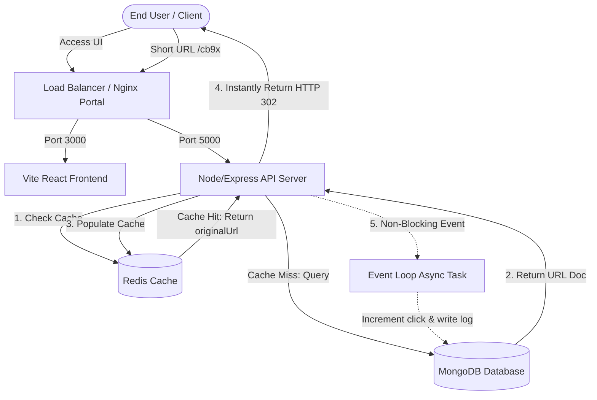
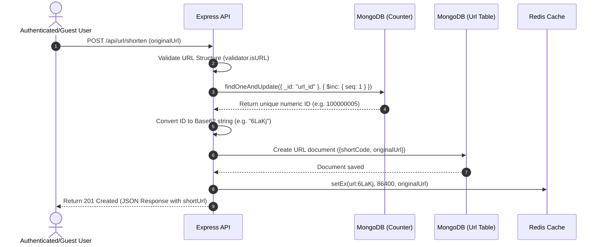
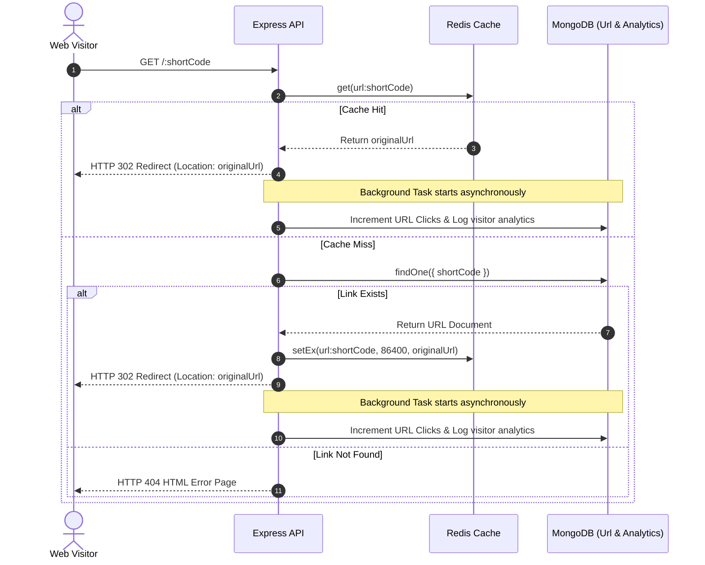

# ShortLink - Scalable URL Shortener System
## Technical Project Report & Systems Design Documentation

---

### 1. Introduction
In the modern internet ecosystem, sharing hyperlinks is a primary method of information exchange. However, uniform resource locators (URLs) frequently contain extensive paths, parameters, query tokens, and tracking cookies, resulting in long strings that are visually cluttered and difficult to share, print, or adapt to character-limited communication channels (e.g., text messages, print media, QR codes, microblogging platforms).

**ShortLink** is a production-ready, full-stack URL shortening system designed to convert long, unstructured web addresses into compact, unique, and secure short codes using a Base62 mapping algorithm. Beyond simple redirection, ShortLink provides detailed tracking and web analytics. This system implements core backend engineering paradigms, including:
* **Atomic auto-increment sequencing** for collision-free identifier generation.
* **Cache-aside caching pattern** via Redis to offload read strain from the relational database.
* **Non-blocking asynchronous background tracking** for analytics logging.
* **Rate-limiting and JWT authentication** to secure the infrastructure and dashboard interfaces.

---

### 2. Problem Statement
A URL shortener must resolve two conflicting requirements:
1. **Uniqueness and Compactness**: Short links must be as brief as possible while ensuring that no two distinct original URLs share the same short code.
2. **High Read Throughput**: A single short link might experience sudden traffic spikes (viral social media posts, email newsletters), leading to millions of redirections. The system must process redirections with sub-10ms response times while operating on modest hardware resources.

Additionally, tracing visitor trends (such as geographic locations, device types, browser clients, and referrer traffic) is crucial for commercial shortening tools. Logging these interactions synchronously during the redirection lifecycle introduces latency and introduces database write bottlenecks, degrading user experience.

---

### 3. Existing System Problems
Many conventional or custom-built URL shorteners rely on the following flawed architectures:
* **Random Hash Generation (e.g., MD5/SHA256 truncation)**: Truncating a cryptographic hash to 6 or 8 characters generates random strings, but creates a high risk of hash collisions. Handling collisions requires recursive database checking (querying if the code exists, then generating a new code), introducing network round-trip overhead.
* **Synchronous Database Operations**: Incrementing click counts and writing visitor analytics logs *before* returning the HTTP redirection response blocks the server thread, which caps redirection throughput to the limits of the disk write speed.
* **Lack of Caching Layer**: Directing 100% of redirection requests to the primary database exhausts database connections, spikes CPU usage, and causes service outages during traffic surges.
* **Sequential Enumeration Susceptibility**: Standard sequential IDs allow malicious users to crawl and discover private or shortened links via basic enumeration attacks.

---

### 4. Proposed Solution
To resolve these issues, **ShortLink** implements a multi-tier, decoupled architecture:
1. **Collision-Free Base62 Mapping**: Instead of random generation, we assign a unique, sequential 64-bit integer to each incoming URL using a centralized MongoDB counter. This integer is converted to a base-62 representation (`0-9`, `a-z`, `A-Z`), guaranteeing uniqueness and eliminating the possibility of collisions.
2. **Cache-Aside Architecture**: Redirection targets are cached in Redis. When a user requests a short link, the server checks Redis first. On a cache hit, the redirection response is served directly from RAM.
3. **Decoupled Asynchronous Analytics Pipeline**: Redirections are treated as read-heavy operations. The server initiates a non-blocking execution block to log visitor metrics (browser, OS, device, IP, and referrer) to MongoDB. The client is immediately redirected using an HTTP 302 Found status code, ensuring redirections remain highly responsive.

---

### 5. Technology Stack
* **Frontend**: React.js SPA scaffolded with Vite, styled with Tailwind CSS v4 (offering high UI performance, dark/light theme options, and custom glassmorphism panels), using Lucide React for iconography.
* **Backend**: Node.js and Express.js REST API using MVC architecture.
* **Database**: MongoDB (Mongoose ORM) for persistent data storage, incorporating custom indexes on search fields (`shortCode`, `userId`).
* **Cache**: Redis for in-memory mapping of short codes to destination URLs.
* **Deployment/Orchestration**: Docker and Docker Compose for containerized service provisioning.

---

### 6. System Architecture Diagram

Below is the multi-tier system topology showing the separation of data paths for read redirects versus write writes:



---

### 7. Working Flow

#### A. URL Shortening Pipeline (Write Path)


#### B. Redirection Pipeline (Read Path)


---

### 8. Database Design
MongoDB is utilized as our data store, configuring collections with explicit structural schemas:

#### Collection: `counters`
This collection maintains the state of our atomic sequences.
```javascript
{
  _id: String,       // Unique key identifying sequence namespace (e.g. "url_id")
  seq: Number        // Counter tracking current generated index (starts at 100,000,000)
}
```

#### Collection: `users`
Stores user credential hashes and metadata.
```javascript
{
  username: { type: String, unique: true, required: true, lowercase: true, index: true },
  email: { type: String, unique: true, required: true, lowercase: true, index: true },
  passwordHash: { type: String, required: true },
  createdAt: { type: Date, default: Date.now }
}
```

#### Collection: `urls`
Stores short-to-long URL mappings.
```javascript
{
  userId: { type: ObjectId, ref: 'User', index: true, default: null }, // Null represents guest url
  originalUrl: { type: String, required: true },
  shortCode: { type: String, unique: true, required: true, index: true }, // Fast lookups
  clicks: { type: Number, default: 0 },
  createdAt: { type: Date, default: Date.now },
  expiresAt: { type: Date, default: null } // Optional expiration timestamp
}
```

#### Collection: `analytics`
Captures granular visitor clicks.
```javascript
{
  urlId: { type: ObjectId, ref: 'Url', required: true, index: true }, // Index for quick dashboard fetches
  timestamp: { type: Date, default: Date.now, index: true },          // Index for range queries
  ip: { type: String, default: 'Unknown' },
  browser: { type: String, default: 'Unknown' },
  device: { type: String, default: 'Desktop' },
  referrer: { type: String, default: 'Direct' },
  location: { type: String, default: 'Unknown' }
}
```

---

### 9. API Documentation

All API endpoints return JSON payloads with a standard wrapper format:
`{ "success": Boolean, "data": Object/Array, "message": String }`.

#### A. Authentication APIs
* **Register Account**
  * **Endpoint**: `POST /api/auth/register`
  * **Access**: Public (Subject to Auth Rate Limiter)
  * **Payload**:
    ```json
    {
      "username": "coder2026",
      "email": "coder@domain.com",
      "password": "supersecurepass"
    }
    ```
  * **Success Response (201 Created)**:
    ```json
    {
      "success": true,
      "data": {
        "_id": "603d2b2f8a9a2c3a4f6d4d12",
        "username": "coder2026",
        "email": "coder@domain.com",
        "token": "eyJhbGciOiJIUzI1NiIsInR5cCI6IkpXVCJ9..."
      }
    }
    ```

* **Login Account**
  * **Endpoint**: `POST /api/auth/login`
  * **Access**: Public (Subject to Auth Rate Limiter)
  * **Payload**:
    ```json
    {
      "emailOrUsername": "coder2026",
      "password": "supersecurepass"
    }
    ```
  * **Success Response (200 OK)**:
    ```json
    {
      "success": true,
      "data": {
        "_id": "603d2b2f8a9a2c3a4f6d4d12",
        "username": "coder2026",
        "email": "coder@domain.com",
        "token": "eyJhbGciOiJIUzI1NiIsInR5cCI6IkpXVCJ9..."
      }
    }
    ```

#### B. URL Management APIs
* **Shorten URL**
  * **Endpoint**: `POST /api/url/shorten`
  * **Access**: Public (Optional Bearer Token; Guest users allowed; rate limited to 30 creations/minute)
  * **Payload**:
    ```json
    {
      "originalUrl": "https://developer.mozilla.org/en-US/docs/Web/HTTP/Status/302",
      "expiresAt": "2026-12-31T23:59:59.000Z"
    }
    ```
  * **Success Response (201 Created)**:
    ```json
    {
      "success": true,
      "data": {
        "_id": "603d2b7f8a9a2c3a4f6d4d18",
        "originalUrl": "https://developer.mozilla.org/en-US/docs/Web/HTTP/Status/302",
        "shortCode": "6LaKg",
        "clicks": 0,
        "createdAt": "2026-06-25T16:38:14.000Z",
        "expiresAt": "2026-12-31T23:59:59.000Z",
        "shortUrl": "http://localhost:5000/6LaKg"
      }
    }
    ```

* **Get My Short URLs**
  * **Endpoint**: `GET /api/url/my-urls`
  * **Access**: Private (Bearer Token required)
  * **Success Response (200 OK)**:
    ```json
    {
      "success": true,
      "data": [
        {
          "_id": "603d2b7f8a9a2c3a4f6d4d18",
          "userId": "603d2b2f8a9a2c3a4f6d4d12",
          "originalUrl": "https://developer.mozilla.org/en-US/docs/Web/HTTP/Status/302",
          "shortCode": "6LaKg",
          "clicks": 142,
          "createdAt": "2026-06-25T16:38:14.000Z",
          "expiresAt": "2026-12-31T23:59:59.000Z",
          "shortUrl": "http://localhost:5000/6LaKg"
        }
      ]
    }
    ```

* **Delete Short URL**
  * **Endpoint**: `DELETE /api/url/:id`
  * **Access**: Private (Bearer Token required; enforces ownership checks)
  * **Success Response (200 OK)**:
    ```json
    {
      "success": true,
      "message": "Short URL deleted successfully"
    }
    ```

#### C. Analytics API
* **Get URL Analytics**
  * **Endpoint**: `GET /api/analytics/:urlId`
  * **Access**: Private (Bearer Token required; enforces ownership checks)
  * **Success Response (200 OK)**:
    ```json
    {
      "success": true,
      "data": {
        "url": {
          "_id": "603d2b7f8a9a2c3a4f6d4d18",
          "originalUrl": "https://developer.mozilla.org/en-US/docs/Web/HTTP/Status/302",
          "shortCode": "6LaKg",
          "clicks": 5,
          "createdAt": "2026-06-25T16:38:14.000Z",
          "expiresAt": null,
          "shortUrl": "http://localhost:5000/6LaKg"
        },
        "clickHistory": [
          { "date": "2026-06-19", "clicks": 0 },
          { "date": "2026-06-20", "clicks": 0 },
          { "date": "2026-06-21", "clicks": 1 },
          { "date": "2026-06-22", "clicks": 0 },
          { "date": "2026-06-23", "clicks": 2 },
          { "date": "2026-06-24", "clicks": 1 },
          { "date": "2026-06-25", "clicks": 1 }
        ],
        "deviceBreakdown": [
          { "name": "Desktop", "value": 3 },
          { "name": "Mobile", "value": 2 }
        ],
        "browserBreakdown": [
          { "name": "Chrome 125", "value": 3 },
          { "name": "Safari 17", "value": 2 }
        ],
        "locationBreakdown": [
          { "name": "United States", "value": 4 },
          { "name": "Localhost", "value": 1 }
        ],
        "referrerBreakdown": [
          { "name": "Direct", "value": 3 },
          { "name": "https://github.com/", "value": 2 }
        ]
      }
    }
    ```

---

### 10. Algorithm Explanation

#### A. Base62 Encoding
Base62 represents numbers using 62 unique characters: `[0-9a-zA-Z]`. By mapping numeric IDs to base-62, we represent large numbers using short strings, making it ideal for compact URLs.

Compared to Base64, Base62 is safer for URL applications because it avoids punctuation characters like `+`, `/`, and `=` which require URL percentage encoding.

**Character Conversion Table**:
`0` → `0`, `9` → `9`, `10` → `a`, `35` → `z`, `36` → `A`, `61` → `Z`.

**Math Principle**:
To encode an integer $N$ into Base62, we repeatedly calculate the remainder of division by 62:
$$rem = N \pmod{62}$$
We prepend the character representing $rem$ to the resulting string, and update $N = \lfloor N / 62 \rfloor$, continuing until $N = 0$.

*Example: Encoding ID = 100,000,005*
1. $100,000,005 \div 62 = 1,612,903$ remainder $19 \implies$ `j` (19th char)
2. $1,612,903 \div 62 = 26,014$ remainder $35 \implies$ `z` (35th char)
3. $26,014 \div 62 = 419$ remainder $36 \implies$ `A` (36th char)
4. $419 \div 62 = 6$ remainder $47 \implies$ `L` (47th char)
5. $6 \div 62 = 0$ remainder $6 \implies$ `6` (6th char)

Resulting short code: `6LaKj`

#### B. Collision Handling
Since the input to our Base62 encoder is a unique, auto-incrementing ID managed by MongoDB's atomic `$inc` command, **the resulting short code is guaranteed to be unique**. This avoids the collision issues of hashing algorithms:

| Metric | Random String Gen / Hashing | Atomic Base62 Encoding |
| :--- | :--- | :--- |
| **Collision Probability** | High (grows with database size) | 0% (guaranteed unique ID) |
| **DB Overheads** | High (must query if code exists) | None (instant calculation) |
| **Redundancy Checks** | Required (causes lag) | Not required |
| **Complexity** | $O(N)$ recursive attempts | $O(1)$ constant execution time |

#### C. Redirection Logic
The system uses HTTP 302 Found instead of HTTP 301 Moved Permanently.
If a browser receives a `301 Moved Permanently`, it caches the redirection mapping locally. Subsequent clicks on that short link bypass our servers and go straight to the destination, preventing us from logging analytics.
Using `302 Found` forces the client browser to query our backend on every click, ensuring 100% accurate tracking.

---

### 11. Security Implementation
* **Rate Limiting**: Configured using `express-rate-limit` to prevent brute force attacks:
  * Global API routes: 200 requests per 15 minutes.
  * Authentication (login/register): 15 requests per 15 minutes.
  * URL Generation: 30 links per minute.
* **Password Hashing**: Uses `bcryptjs` with 10 salt rounds to hash user passwords before database storage.
* **Input Validation & Sanitization**:
  * Emails are validated using `validator.isEmail`.
  * Original URLs must start with `http://` or `https://` and match standard URL patterns.
  * NoSQL injection is prevented by Mongoose Schema validation, which drops arbitrary query properties from payload objects.

---

### 12. Scalability Discussion (Handling 1 Million+ Users)

To scale ShortLink to millions of active users and high click volumes, we design the following topology:

#### A. Load Balancers (Nginx / AWS ALB)
Deploys a load balancer in front of our backend Node.js servers. The load balancer distributes incoming HTTP traffic across a pool of stateless Express backend servers using a round-robin algorithm. If an Express instance fails, it is removed from the active pool.

#### B. Stateless Backend Application Servers
Express servers are run in stateless mode, using PM2 or Kubernetes Pods. Since user sessions are authenticated using JWT tokens rather than stateful session files, any server can process any request.

#### C. Redis Cluster
For high-traffic operations, a standalone Redis node can become a memory bottleneck. We scale the cache layer using a **Redis Cluster with Master-Slave replication**:
* **Sharding**: Caches are split across multiple Redis master nodes using hash slots.
* **Read Scalability**: Write operations (adding new links) go to Master nodes, while read operations (resolving redirects) query slave nodes.

#### D. Database Sharding (MongoDB)
When MongoDB collections grow to millions of rows, indexing begins to exceed physical RAM limits. We partition the database using MongoDB Sharding:
* **Shard Key**: We shard the `urls` collection using the `shortCode` field.
* **Effect**: Redirections query specific shards directly, preventing database-wide table scans.

#### E. Race Conditions and Concurrency
* **Sequence Safety**: Auto-increment sequence collisions are avoided using MongoDB's atomic `findOneAndUpdate` operator, which locks only the counter document during sequence updates.
* **Write Bottlenecks**: As traffic grows, saving analytics entries synchronously to MongoDB can degrade database write performance. To scale this, we can queue analytics logs in a Redis List or Kafka topic, and process them in batches using background worker threads.

---

### 13. Future Improvements
1. **Custom URL Aliases**: Allow users to define custom paths (e.g., `short.ly/promo2026`) by checking alias availability before generating sequential codes.
2. **Dynamic QR Code Generation**: Implement QR code generation in the dashboard using libraries like `qrcode` so users can download QR codes for physical print campaigns.
3. **Advanced Link Expiration**: Expand expiration settings to include click-count limits (e.g., expire a link automatically after 100 clicks).
4. **AI Spam Detection**: Integrate Google Safe Browsing or a custom AI classifier to verify destination URLs, blocking phishing and malware links.
